# GitHub Actions Workflows

This document describes all GitHub Actions workflows configured for the `vb-cli` project, their triggers, and the actions they perform.

## Overview

The project uses 7 GitHub Actions workflows to automate testing, building, releasing, and maintaining the codebase:

1. **Continuous Integration (CI)** - Runs tests and builds on every push/PR
2. **Build, Test, and Release** - Handles releases when tags are pushed
3. **Automatic Release** - Creates RC releases for dev branch and final releases for main branch
4. **Validate Workflows** - Validates workflow syntax and security
5. **Update Dependencies** - Automatically updates Go dependencies
6. **Test Release Process** - Manual testing of the release process
7. **Workflow Status** - Monitors workflow failures

---

## 1. Continuous Integration (CI)

**File**: `.github/workflows/ci.yml`

### Triggers
- **Push** to `main` or `dev` branches
- **Pull Request** targeting `main` or `dev` branches

### Purpose
Ensures code quality and functionality on every commit by running comprehensive tests and build verification.

### Actions Performed

#### Job 1: Test and Scan
1. **Checkout code** - Downloads the repository code
2. **Set up Go** - Installs Go 1.25
3. **Cache Go modules** - Caches dependencies for faster builds
4. **Download dependencies** - Runs `go mod download`
5. **Verify dependencies** - Runs `go mod verify` to ensure dependency integrity
6. **Run tests with coverage** - Executes `make test` (requires 100% coverage)
7. **Run security scan** - Executes `make scan` using gosec
8. **Upload coverage reports** - Sends coverage data to Codecov

#### Job 2: Build Test
1. **Checkout code** - Downloads the repository code
2. **Set up Go** - Installs Go 1.25
3. **Cache Go modules** - Caches dependencies
4. **Download dependencies** - Runs `go mod download`
5. **Test build** - Executes `make package` to build the binary
6. **Test binary** - Verifies the built binary works by running:
   - `./dist/vb version`
   - `./dist/vb --help`

---

## 2. Build, Test, and Release

**File**: `.github/workflows/release.yml`

### Triggers
- **Push** with tags matching `v*` pattern (e.g., `v1.0.0`)
- **Pull Request** targeting `main` or `dev` branches
- **Manual dispatch** via GitHub UI

### Purpose
Handles the complete release process including multi-platform builds, release creation, and Homebrew formula updates.

### Actions Performed

#### Job 1: Test and Scan
Same as CI workflow - runs tests and security scans.

#### Job 2: Build for all platforms
**Only runs on tag pushes**

Builds the binary for 5 different platforms:
- Linux AMD64
- Linux ARM64
- macOS AMD64
- macOS ARM64
- Windows AMD64

For each platform:
1. **Checkout code** - Downloads the repository
2. **Set up Go** - Installs Go 1.25
3. **Cache Go modules** - Caches dependencies
4. **Download dependencies** - Runs `go mod download`
5. **Verify dependencies** - Runs `go mod verify`
6. **Build binary** - Compiles with platform-specific settings:
   - Sets `GOOS` and `GOARCH` environment variables
   - Disables CGO (`CGO_ENABLED=0`)
   - Embeds version information via `-X main.version=${{ github.ref_name }}`
   - Strips debug symbols (`-ldflags="-s -w"`)
7. **Upload build artifacts** - Saves each platform binary as a separate artifact

#### Job 3: Create Release
**Only runs on tag pushes**

1. **Checkout code** - Downloads the repository
2. **Download all artifacts** - Retrieves all platform binaries
3. **Prepare release assets**:
   - Copies binary files directly for each platform:
     - Linux/macOS: Binary files without extension
     - Windows: Binary files with `.exe` extension
   - Generates SHA256 checksums for all files
4. **Generate changelog**:
   - Extracts version from code (`internal/version/version.go`) for consistency
   - Generates changelog from git commits since last tag
   - Creates release notes with installation instructions
   - Sets appropriate title (e.g., "Release v1.0.1" or "Release Candidate v1.0.1-rc")
5. **Create Release** - Publishes GitHub release with:
   - All platform binaries (direct binary files)
   - Checksums file
   - Generated release notes
   - Automatic prerelease detection for alpha/beta/rc tags

#### Job 4: Update Homebrew Formula
**Only runs on stable releases (no alpha/beta/rc tags)**

1. **Checkout homebrew-tap** - Downloads the Homebrew tap repository
2. **Update formula**:
   - Downloads macOS ARM64 binary to calculate SHA256
   - Generates updated Homebrew formula with new version and checksum
3. **Commit and push changes** - Updates the Homebrew tap with new formula

---

## 3. Automatic Release

**File**: `.github/workflows/auto-release.yml`

### Triggers
- **Push** to `main` branch (creates final releases)
- **Push** to `dev` branch (creates release candidate releases)
- **Manual dispatch** with release type selection

### Purpose
Automatically creates releases based on branch merges:
- **Feature branch → dev**: Creates release candidate (RC) releases
- **Dev → main**: Creates final releases
- **Direct push to dev**: Creates RC releases

### Actions Performed

#### Job 1: Determine Release Type and Version
1. **Checkout code** - Downloads the repository with full history
2. **Check if should release** - Determines if release should be created based on branch:
   - **dev branch**: Always creates RC releases (feature branch → dev, or direct push to dev)
   - **main branch**: Creates final releases only when merging from the `dev` branch (merge commit must match `Merge pull request … from */dev`)
   - **Other branches**: No release
3. **Get current version** - Extracts version from `internal/version/version.go` (more reliable than git tags)
4. **Use code version** - Uses the version directly from the code instead of calculating:
   - **All branches**: Uses the version specified in `internal/version/version.go`
   - **Manual dispatch**: Uses code version (manual version bumping requires updating the code first)
   - **Tag replacement**: Automatically replaces existing tags if they don't match the code version

#### Job 2: Test and Scan
**Only runs if release should be created**
Same as CI workflow - runs comprehensive tests and security scans.

#### Job 3: Build for all platforms
**Only runs if release should be created**
1. **Checkout code** - Downloads the repository
2. **Set up Go** - Installs Go 1.25
3. **Cache Go modules** - Caches dependencies
4. **Update version file** - Updates `internal/version/version.go` with new version
5. **Download dependencies** - Runs `go mod download`
6. **Verify dependencies** - Runs `go mod verify`
7. **Build binary** - Compiles for all 5 platforms with new version embedded
8. **Upload build artifacts** - Saves each platform binary as separate artifact

#### Job 4: Create Release
**Only runs if release should be created**
1. **Checkout code** - Downloads the repository with full history
2. **Download all artifacts** - Retrieves all platform binaries
3. **Prepare release assets** - Creates binary files and checksums:
   - Downloads build artifacts from all platforms
   - Copies platform-specific binaries:
     - Linux/macOS: Binary files without extension
     - Windows: Binary files with `.exe` extension
   - Generates SHA256 checksums for all files
4. **Generate changelog** - Creates release notes with:
   - Different titles and descriptions for RC vs final releases
   - Installation instructions
   - Verification steps
   - Proper release titles (e.g., "Release v1.0.1" or "Release Candidate v1.0.1-rc")
5. **Commit version update** - Commits the updated `internal/version/version.go` from the build job back to the source branch
6. **Create Git Tag** - Attempts to create and push the release tag (prints remediation guidance if restricted by repository rules)
7. **Create Release** - Publishes GitHub release with proper prerelease flag using `softprops/action-gh-release`
8. **Handle failure** - When release creation fails, uploads release assets as artifacts and emits instructions for performing the release manually

#### Job 5: Update Homebrew Formula
**Only runs for final releases (not RC)**

1. **Checkout homebrew-tap** - Downloads the Homebrew tap repository
2. **Update formula** - Updates Homebrew formula with new version and checksum
3. **Commit and push changes** - Updates the Homebrew tap

### Version Management
- **Automatic versioning**: Increments patch version for each release, promoting RC tags to finals on merges to `main`
- **RC releases**: Adds `-rc` suffix for dev branch releases
- **Final releases**: Clean semantic version for main branch releases
- **Version file update**: Build job writes the new version to `internal/version/version.go` and the release job commits it
- **Git tagging**: Creates annotated tags per release and surfaces remediation tips when tag creation is blocked

### Manual Release Options
When triggered manually via `workflow_dispatch`, supports:
- **auto**: Determines type based on current branch (default)
- **patch**: Increments patch version (e.g., v1.0.0 → v1.0.1)
- **minor**: Increments minor version (e.g., v1.0.0 → v1.1.0)
- **major**: Increments major version (e.g., v1.0.0 → v2.0.0)
- **rc**: Creates release candidate (e.g., v1.0.0 → v1.0.1-rc)

### Conditional Execution
- Jobs 2-5 only run if `should-release` output is `true`
- Homebrew formula update only runs for final releases (not RC releases)
- All jobs depend on the previous job's success; release failures still publish the build outputs as workflow artifacts for manual follow-up

---

## 4. Validate Workflows

**File**: `.github/workflows/validate-workflows.yml`

### Triggers
- **Push** that modifies `.github/workflows/*.yml` or `.github/workflows/*.yaml`
- **Pull Request** that modifies workflow files

### Purpose
Ensures all GitHub Actions workflows are syntactically correct and follow security best practices.

### Actions Performed

1. **Checkout code** - Downloads the repository
2. **Install actionlint** - Installs the actionlint tool for workflow validation
3. **Validate workflow syntax** - Runs `actionlint` on all workflow files
4. **Validate YAML syntax** - Validates YAML syntax using Python's yaml module
5. **Check for unpinned action versions** - Searches for `@main` or `@master` references
6. **Check for custom secrets usage** - Identifies custom secrets usage
7. **Check for explicit permissions** - Lists workflows with explicit permissions

---

## 4. Update Dependencies

**File**: `.github/workflows/update-dependencies.yml`

### Triggers
- **Scheduled** - Every Monday at 9 AM UTC
- **Manual dispatch** via GitHub UI

### Purpose
Automatically keeps Go dependencies up to date by creating pull requests with updated dependencies.

### Actions Performed

1. **Checkout code** - Downloads the repository
2. **Set up Go** - Installs Go 1.25
3. **Update dependencies**:
   - Runs `go get -u ./...` to update all dependencies
   - Runs `go mod tidy` to clean up go.mod and go.sum
4. **Check for changes** - Detects if any files were modified
5. **Create Pull Request** (if changes detected):
   - Uses `peter-evans/create-pull-request@v7` action
   - Automatically creates branch `chore/update-dependencies`
   - Commits changes with message "chore: update dependencies"
   - Creates PR with title "chore: update Go dependencies"
   - Includes checklist for testing requirements
   - Auto-deletes the branch after PR is merged (`delete-branch: true`)

---

## 5. Test Release Process

**File**: `.github/workflows/test-release.yml`

### Triggers
- **Manual dispatch only** with required input:
  - `version`: Version string to test (default: "v1.0.0-test", type: string)

### Purpose
Allows manual testing of the complete release process without creating actual releases.

### Actions Performed

#### Job 1: Test Multi-platform Build
1. **Checkout code** - Downloads the repository
2. **Set up Go** - Installs Go 1.25
3. **Cache Go modules** - Caches dependencies
4. **Download dependencies** - Runs `go mod download`
5. **Verify dependencies** - Runs `go mod verify`
6. **Run tests** - Executes `make test`
7. **Run security scan** - Executes `make scan`
8. **Build binary** - Builds for all 5 platforms using the provided version
9. **Test binary** - Verifies each binary works:
   - Windows: Tests `.exe` files with `./dist/vb-{platform}.exe version` and `--help`
   - Unix: Tests regular binaries with `./dist/vb-{platform} version` and `--help`
10. **Upload test artifacts** - Saves all platform binaries as artifacts

#### Job 2: Test Package Creation
1. **Checkout code** - Downloads the repository
2. **Download all artifacts** - Retrieves all platform binaries
3. **Create test packages**:
   - Creates binary files (same as release process)
   - Generates checksums
   - Lists created packages
4. **Upload test packages** - Saves all test packages as artifacts

---

## 6. Workflow Status

**File**: `.github/workflows/status.yml`

### Triggers
- **Workflow run completion** for "CI" or "Pre-commit" workflows
- **Only runs when workflow conclusion is not 'success'**

### Purpose
Provides monitoring and notification when critical workflows fail.

### Actions Performed

1. **Notify on failure** - Outputs failure information:
   - Workflow name that failed
   - Failure conclusion reason
   - Direct link to the failed workflow run

---

## Workflow Dependencies

```mermaid
graph TD
    A[Push/PR] --> B[CI Workflow]
    A --> C[Validate Workflows]
    B --> D[Test & Scan]
    B --> E[Build Test]

    F[Tag Push] --> G[Release Workflow]
    G --> H[Test & Scan]
    G --> I[Multi-platform Build]
    G --> J[Create Release]
    G --> K[Update Homebrew]

    L[Push to main] --> M[Auto Release - Final]
    N[Push to dev] --> O[Auto Release - RC]
    P[Manual Dispatch] --> Q[Auto Release - Manual]
    M --> R[Test & Scan]
    M --> S[Multi-platform Build]
    M --> T[Create Release]
    M --> U[Update Homebrew]
    O --> V[Test & Scan]
    O --> W[Multi-platform Build]
    O --> X[Create RC Release]
    Q --> Y[Test & Scan]
    Q --> Z[Multi-platform Build]
    Q --> AA[Create Release]

    BB[Schedule/Manual] --> CC[Update Dependencies]
    CC --> DD[Create PR]

    EE[Manual] --> FF[Test Release]
    FF --> GG[Test Build]
    FF --> HH[Test Package]

    II[Workflow Failure] --> JJ[Status Monitor]
```

## Security Considerations

- All workflows use pinned action versions (no `@main` or `@master`)
- Dependencies are verified with `go mod verify`
- Security scans run on every build using gosec
- Homebrew formula updates only occur for stable releases
- Workflow validation ensures no security issues in CI/CD pipeline

## Version Management

- **Consistent Versioning**: Both release and auto-release workflows extract version from `internal/version/version.go` instead of relying on tag names
- **Prevents Tag Mismatches**: This approach prevents issues where manual tags don't match the code version
- **Robust Release Process**: Ensures release names always match the actual code version
- **Automatic Tag Replacement**: Auto-release workflow automatically replaces existing tags that don't match the code version
- **Code-First Approach**: Version changes must be made in `internal/version/version.go` first, then committed
- **Manual Tag Prevention**: Documentation warns against manual tag creation to maintain consistency

## Environment Variables

- `GO_VERSION`: Set to "1.25" across all workflows
- `BINARY_NAME`: Set to "vb" for release workflows
- `GITHUB_TOKEN`: Used for repository operations and PR creation

## Artifacts and Outputs

- **CI**: Coverage reports uploaded to Codecov
- **Release**: Multi-platform binaries, checksums, and release notes
- **Test Release**: Test packages and binaries for validation
- **Dependencies**: Pull requests with updated dependencies

---

For more information about the project's development workflow, see [DEVELOPMENT.md](DEVELOPMENT.md).
